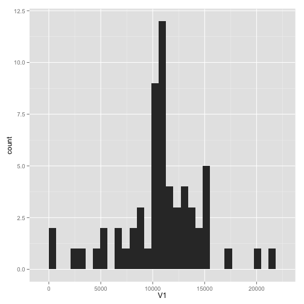

# Reproducible Research: Peer Assessment 1

Hello!  Welcome to my Assessment 1.  I hope you find my work easy enough to follow and I will do my best to guide you through and explain everything.

## Loading and preprocessing the data

In this analysis, I will be using 3 packages, "data.table", "ggplot2", and "timeDate".  "data.table" had some features that helped with summing and taking averages of values in my data set.  "ggplot2" was used to create the histogram, and "timeDate" was used to split the data set into weekdays and weekends.  Otherwise, this first piece of code should be straight forward.


```r
library(data.table)
library(ggplot2)
library(timeDate)

data <- read.csv(file = "/Users/Mario/RepData_PeerAssessment1/activity.csv")
data <- data.table(data)  ## Convert to a data table in order to make some things easier later.
data_removed_NA <- subset(data, steps != "NA")  ## Create a new data table without NA values.
```

## What is mean total number of steps taken per day?

In this piece of code I will be creating a histogram with ggplot and also calculating what the mean and median are for the total number of steps taken per day.  In other words, I will take the total number of steps taken on each day, and find the mean and median of those individual totals.


```r
daily_totals <- data[,sum(steps),by=date]  ## This is a data table where each row is a date and the steps for that date.
daily_totals_removed_NA <- data_removed_NA[,sum(steps),by=date]  ## This is the same as the previous line, but no NA's.
mean_of_daily_totals_removed_NA <- mean(daily_totals_removed_NA[,V1])  ## This is the mean of total steps taken each day.
median_of_daily_totals_removed_NA <- median(daily_totals_removed_NA[,V1])  ## This is the median of total steps taken each day.
ggplot(daily_totals,aes(x=V1))+geom_histogram()  ## This plot shows the distribution of number of steps taken per day. X is steps, Y is count.
```

```
## stat_bin: binwidth defaulted to range/30. Use 'binwidth = x' to adjust this.
```

 

```r
mean_of_daily_totals_removed_NA  ## print out
```

```
## [1] 10766
```

```r
median_of_daily_totals_removed_NA  ## print out
```

```
## [1] 10765
```

And our results are:  The mean number of steps taken per day is 1.0766 &times; 10<sup>4</sup> and the median is 1.0766 &times; 10<sup>4</sup>.  Please pardon the scientific notation.

## What is the average daily activity pattern?

The next thing we are interested in knowing is on a typical day, how many steps are being taken throughout each part of the day?  Included is a plot that shows precisely that.  Notice that the subject appears to wake up at about 5:30am and walks a lot until about 10:00am, possibly indicating a morning jog and a commute to work.  Steps then begin to decline at around 8:00pm as would be expected.  Another interesting thing to look at would be at what moment of the day does the most stepping tend to occur.


```r
daily_pattern <- data_removed_NA[,mean(steps),by=interval]
smoothed_time <- seq(0,2399,2400/288)  ## This was an improvement I felt on the independent variable.  Since the time intervals used a nonstandard format, 850 representing 8:50, this led to "gaps" because the value that followed 855 was 900.  So I instead used a sequence with no gaps.

plot(smoothed_time,daily_pattern$V1,type="l",xlab="Time of day (military time)",ylab="Steps per 5 minute interval",main="Average of steps taken within each interval across all days")
```

 

```r
daily_pattern_sorted <- daily_pattern[order(V1,decreasing=TRUE)]  ## lets order the data table based on number of steps taken.
head(daily_pattern_sorted,n=10)  ## Here we'll print out the data table and see what's at the top.
```

```
##     interval    V1
##  1:      835 206.2
##  2:      840 195.9
##  3:      850 183.4
##  4:      845 179.6
##  5:      830 177.3
##  6:      820 171.2
##  7:      855 167.0
##  8:      815 157.5
##  9:      825 155.4
## 10:      900 143.5
```

As you can see by the sorted list of average number of steps taken per day, the maximum occurs at 835 with an average number of steps of 206.1698.  Remember to make note of the nonstandard time format.  For example, a value of "835" represents 8:35am.

## Imputing missing values

This part of the assignment gave me a headache at first, but all turned out well in the end.  As you can see in the code, after making some careful adjustments for data types and differences between data frames and data tables, I was able to use a for loop and if statement to compare values in the data set to NA, and if they were NA, to then replace that value with the corresponding value from the vector I created of the interval averages.  Also of note is in what manner did replacing these NA values affect our prior calculations of mean and median of the number of steps walked each day.  Also included is an updated histogram of number of steps walked each day.  Notice that there will be no difference in the shape of the histogram, except in the area that represents the mean.  That value should increase by about 8, since there were 8 days in the original data set that were missing data completely.


```r
length(data[,steps])-length(data_removed_NA[,steps])  ## This is equal to the number of NA values in the data.
```

```
## [1] 2304
```

```r
daily_pattern_long <- rep(daily_pattern[,V1],61)  ## The purpose of this was to make the vector the same length as the data table, for easy line by line comparison.
data_filled_in <- data.frame(data)  ## create a new copy.

data_filled_in[,1] <- as.numeric(data_filled_in[,1])  ## since the vector has numberic types, best to just make this whole column numeric as well.  Otherwise, the replaced NA's will become numeric types, while the unreplaced original values will be int types.

## line by line comparison.
for (i in 1:17568){  
  if (identical(data_filled_in[,1][i],as.numeric(NA))){
    data_filled_in[,1][i] = daily_pattern_long[i]
  }
}

data_filled_in <- data.table(data_filled_in)  ## make it into a data table again
             
daily_totals_removed_NA <- data_removed_NA[,sum(steps),by=date]  ## these two lines are equivalent to what was done ealier
daily_totals_filled_in <- data_filled_in[,sum(steps),by=date]

ggplot(daily_totals_filled_in,aes(x=V1))+geom_histogram()  ## new histogram.  Only difference is 8 new values at the same location.
```

```
## stat_bin: binwidth defaulted to range/30. Use 'binwidth = x' to adjust this.
```

 

```r
mean(daily_totals_filled_in[,V1]) - mean(daily_totals_removed_NA[,V1])  ### difference
```

```
## [1] 0
```

```r
median(daily_totals_filled_in[,V1]) - median(daily_totals_removed_NA[,V1])  ### difference
```

```
## [1] 1.189
```

First let's answer the question of how many NA values were in the original data set.  I did this by comparing the lengths of the data tables before and after removing the NA values.  I found the number of NA values to be: 2304

So let's next take a look at what happened to the mean.  The value with the NA's ignored was 1.0766 &times; 10<sup>4</sup> and when we filled in the values, the mean became 1.0766 &times; 10<sup>4</sup>, leading to a difference of 0.  Looking at the median now, with the NA's ignored the median was 10765, the value after replacing the NA's was 1.0766 &times; 10<sup>4</sup>, leading to a difference of 1.1887.

## Are there differences in activity patterns between weekdays and weekends?

The last thing we are going to look at is actually very interesting.  We will compare what a typical weekday to a typical weekend (not the whole weekend... just a weekend day) and see what visual differences become apparent.  I used the function isWeekday() in the timeDate package in order to subset my data frame.  isWeekday() brings back a logical value when given a date.  Note, I did not add another vairable to the data table, but the result was equivalent for our purposes.


```r
daily_pattern_weekDay <- subset(data_filled_in,isWeekday(date))[,mean(steps),by=interval]  ## subsetting by logical value, isWeekday(), then mean
daily_pattern_weekEnd <- subset(data_filled_in,!isWeekday(date))[,mean(steps),by=interval]  ## subsetting by logical value, isWeekday(), then mean

par(mfrow=c(2,1))  ## lets put both plots into the same window

### Weekday
plot(smoothed_time,daily_pattern_weekDay$V1,type="l",xlab="Time of day (military time)",ylab="Steps per 5 minute interval",main="Weekdays: Average of steps taken within each interval across all days")

### Weekend
plot(smoothed_time,daily_pattern_weekEnd$V1,type="l",xlab="Time of day (military time)",ylab="Steps per 5 minute interval",main="Weekends: Average of steps taken within each interval across all days")
```

 

I found this very cool.  On a typical weekeday, most of the steps occur in the morning just like in the overall data set.  Since 5/7th of every week is a weekday, the overall plot was heavily weighted to whatever was occuring on weekdays.  What's also interesting is that the weekend plot shows that steps are taken throughout the entire day, not just during the morning like during the week.  Also notice how our subject does not start taking steps until later in the morning on weekends, likely and reasonably due to waking up later.  Likewise, notice that steps continue occuring until later in the night than occurs on weekdays.

## The end! I hope you enjoyed my submission!
